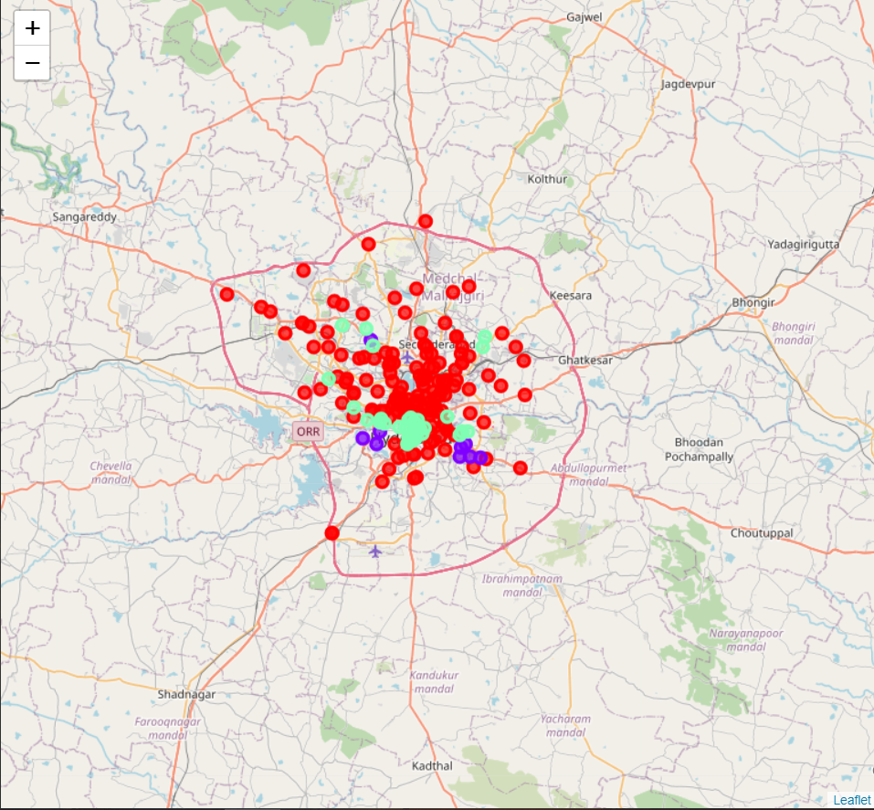

<h1 align="center">Coursera Capstone Project</hi>
<h2 align="center">IBM Applied DataScience Capstone</h2>
<h3 align="center"><i>Opening a new shopping center in Hyderabad, Telangana</i></h3>

<h3 align="center"><b>Sathwik Vadlamani</b></h3>
<h3 align="center"><b>May 2020</b></h3>


## Introduction

Hyderabd is famous for its centuries-old monuments, but the rise of numerous malls in Hyderabad has added a stylish edge to the economic powerhouse. Well-heeled travellers can choose from various swanky malls housing world-renowned fashion labels, global restaurants and cinemas. If you have the budget to back you, then get ready to splurge at these malls during your next visit to Hyderabad.

Retailers in Hyderabad have displayed a preference for hosting their brands in high-street outlets over shopping malls of late. The trend is growing on the back of locational advantage, lower rentals and personalised experience that exclusive stores offer to customers.


## Business Problem

The Objective of this capstone project is to analyse and select the best locations in the city of Hyderabad, Telangana to open a new shopping center. Using data science methodology and machine learninng techniques like clustering. This project aims to provide solutions to answer the bsiness question: In the city of Hyderabad, Telanagan, if a property developer is looking to open a new shopping center, where would you recommend that they open it?

## Target Audience

This project is particularly useful to property developers and investors looking to open or invest in new shopping centers in the capital city of Telangana i.e Hyderabad. A recent article from the _The times of India_ states that 

> Evolving consumer spending patterns and increasing disposable income are redefining the retail landscape in Hyderabad. Retail brands which earlier preferred shopping malls are now vying for shops in high-street complexes owing to lower rental rates, higher brand visibility and relatively higher sales than their counterparts in malls.

## Data 

**To solve the following problem we will need the following data:**

- List of neighbourhoods in Hydearabad. This defines the scope of this project which is confined to the city of Hydrabad, the capital city of the state of Telangana in India.
- Latitude and longitude coordinates of those neighbourhoods. This is required in order to plot the map and also to get the venue data.
- Venue data, particularly data related to shopping malls. We will use this data to perform clustering on the neighbourhoods.

**Sources of data and methods to extract them**

This [wikipedia page](https://en.wikipedia.org/wiki/Category:Neighbourhoods_in_Hyderabad,_India) contains a list of neighbourhoods in Hyderabad, with a total of 220 neighbourhoods. We will use web scraping techniques to extract the data from the Wikipedia page, with the help of Python requests and ```Beautifulsoup``` packages. Then we will get the geographical coordinates of the neighbourhoods using Python ```Geocoder``` package which will give us the latitude and longitude coordinates of the neighbourhoods.

After that, we will use Foursquare API to get the venue data for those neighbourhoods. Foursquare has one of the largest database of 105+ million places and is used by over 125,000 developers. Foursquare API will provide many categories of the venue data, we are particularly interested in the Shopping Mall category in order to help us to solve the business problem put forward. This is a project that will make use of many data science skills, from web scraping (Wikipedia), working with API (Foursquare), data cleaning, data wrangling, to machine learning (K-means clustering) and map visualization (Folium). In the next section, we will present the Methodology section where we will discuss the steps taken in this project, the data analysis that we did and the machine learning technique that was used.

## Methodology

Firstly, we need to get the list of neighbourhoods in the city of Hyderabad. Fortunately, the list is available in the [Wikipedia page](https://en.wikipedia.org/wiki/Category:Neighbourhoods_in_Hyderabad,_India). We will do web scraping using Python requests and ```Beautifulsoup``` packages to extract the list of neighbourhoods data. However, this is just a list of names. We need to get the geographical coordinates in the form of latitude and longitude in order to be able to use ```Foursquare API```. To do so, we will use the wonderful ```Geocoder``` package that will allow us to convert address into geographical coordinates in the form of latitude and longitude. After gathering the data, we will populate the data into a pandas DataFrame and then visualize the neighbourhoods in a map using Folium package. This allows us to perform a sanity check to make sure that the geographical coordinates data returned by Geocoder are correctly plotted in the city of Hyderabad.

Next, we will use ```Foursquare API``` to get the top 100 venues that are within a radius of 2000 meters. We need to register a Foursquare Developer Account in order to obtain the Foursquare ID and Foursquare secret key. We then make API calls to Foursquare passing in the geographical coordinates of the neighbourhoods in a Python loop. Foursquare will return the venue data in JSON format and we will extract the venue name, venue category, venue latitude and longitude. With the data, we can check how many venues were returned for each neighbourhood and examine how many unique categories can be curated from all the returned venues. Then, we will analyse each neighbourhood by grouping the rows by neighbourhood and taking the mean of the frequency of occurrence of each venue category. By doing so, we are also preparing the data for use in clustering. Since we are analysing the _Shopping Center_ data, we will filter the ```Shopping Mall``` as venue category for the neighbourhoods.

Lastly, we will perform clustering on the data by using **k-means clustering**. K-means clustering algorithm identifies k number of centroids, and then allocates every data point to the nearest cluster, while keeping the centroids as small as possible. It is one of the simplest and popular unsupervised machine learning algorithms and is particularly suited to solve the problem for this project. We will cluster the neighbourhoods into 3 clusters based on their frequency of occurrence for ```Shopping Mall```. The results will allow us to identify which neighbourhoods have higher concentration of shopping malls while which neighbourhoods have fewer number of shopping malls. Based on the occurrence of shopping malls in different neighbourhoods, it will help us to answer the question as to which neighbourhoods are most suitable to open new shopping malls.

## Results

The results from the k-means clustering show that we can categorize the neighbourhoods into 3 clusters based on the frequency of occurrence for ```Shopping Mall```:

- Cluster 0: Neighbourhoods with high number of shopping centers.
- Cluster 1: Neighbourhoods with low number of shopping centers.
- Cluster 2: Neighbourhoods with moderate concentration of shopping malls.

The results of the clustering are visualized in the map below with cluster 0 in red colour, cluster 1 in purple colour, and cluster 2 in mint green colour.



## Discussions & observations

- Most of the shopping malls and the shopping centers are concentrated in the center of the city.
 - The highest number of shopping centres are concentrated in the cluster 0 moderate in cluster 2, and lowest in cluster 1.
 - cluster 0 is the densest among the clusters and the cluster becomes sparse as we move outward towards the city.
 - Cluster 0 closer to the financial district has a very high chance of success rate and good potential to business expansion and guarantees a lot of investments
 - cluster 1 te sallest cluster also has a good potential but not as good as cluster 0.
 - cluster 2 is the most competetive cluster among the clusters and has very low success rate.
 - cluster 2 is also a dense cluster and unlike cluster 0 it is concentrated in the heart of the city having highly competetive markets and offers almost highly impossible growth rate for beginners.

## Limitations and Suggestions for Future Reasearch

In this project, we only consider one factor i.e. frequency of occurrence of shopping malls, there are other factors such as population and income of residents that could influence the location decision of a new shopping mall. However, to the best knowledge of this researcher such data are not available to the neighbourhood level required by this project. Future research could devise a methodology to estimate such data to be used in the clustering algorithm to determine the preferred locations to open a new shopping mall. In addition, this project made use of the free Sandbox Tier Account of Foursquare API that came with limitations as to the number of API calls and results returned. Future research could make use of paid account to bypass these limitations and obtain more results.

The k value in the k-means clustering algorithms can be tuned even more as the best k here is chosen by iterative trial & error methods.

The efficiencyof the model can be further increased further by applying comprehensive evaluation techniques.

## Conclusion
In this project, we have gone through the process of identifying the business problem, specifying the data required, extracting and preparing the data, performing machine learning by clustering the data into 3 clusters based on their similarities, and lastly providing recommendations to the relevant stakeholders i.e. property developers and investors regarding the best locations to open a new shopping mall. To answer the business question that was raised in the introduction section, the answer proposed by this project is:

> The neighbourhoods in the outskirts of cluster 0 and the cluster 2 are the most preferred locations to open a new shopping mall. The findings of this project will help the relevant stakeholders to capitalize on the opportunities on high potential locations while avoiding overcrowded areas in their decisions to open a new shopping mall.
